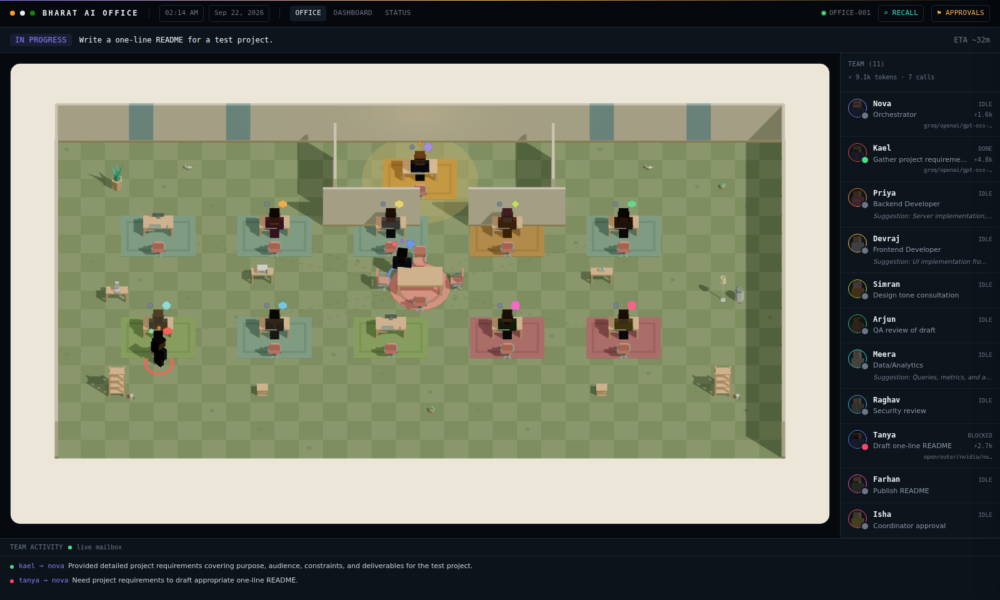
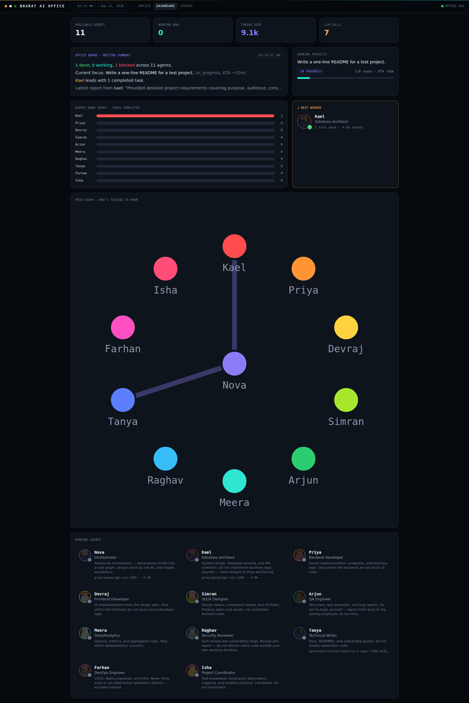
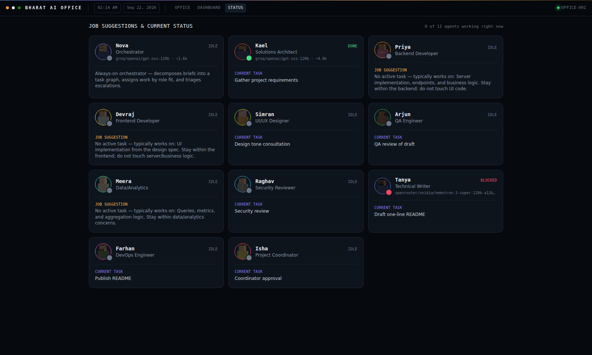
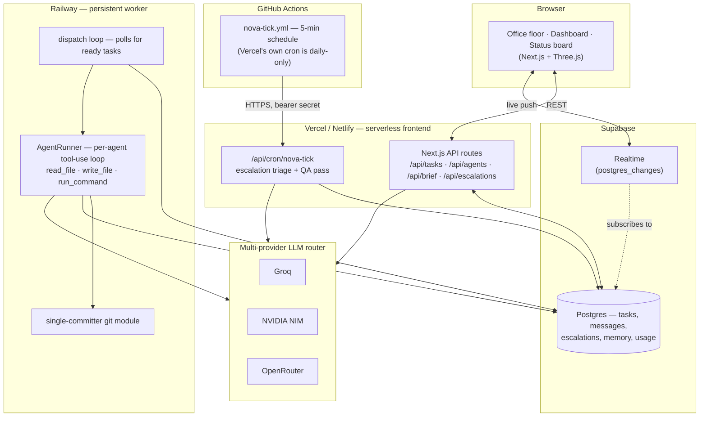
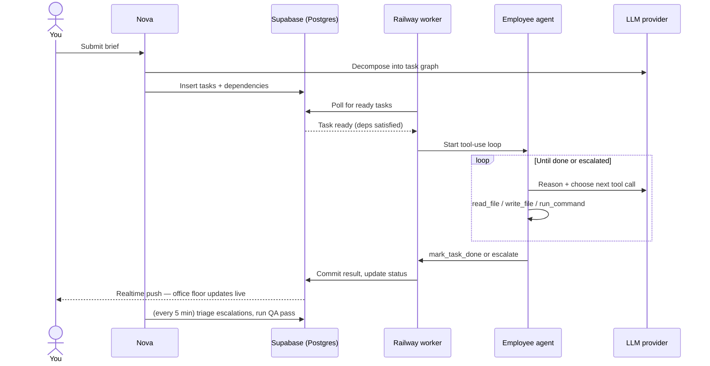

# 🏢 Bharat AI Office

**A single project brief becomes a fully staffed AI office.** One orchestrator (Nova) and 10 specialist employees — architect, backend, frontend, design, QA, data, security, docs, DevOps, coordination — decompose it into a task graph, work it in parallel with real file/shell tool access, and commit real results, all visualized as a live office floor you can watch in real time.

[](https://bharat-ai-office-frontend.vercel.app)
[](https://bharat-ai-office.netlify.app)
[](https://github.com/kushagra486/BharatAi-office/actions/workflows/nova-tick.yml)

**[▶ Try the live demo](https://bharat-ai-office-frontend.vercel.app)**

---

## What this actually is

Submit one brief — "build a landing page," "write API docs," "audit this repo for security issues" — and:

1. **Nova** (the orchestrator) decomposes it into a dependency-ordered task graph and assigns each task to the employee whose role fits.
2. Each employee runs its own **tool-use loop** (read/write files, run shell commands) sandboxed to its own working directory, and reports back — done, or escalated if blocked.
3. Nova triages escalations and runs a QA pass once all tasks complete.
4. Every step streams live to the 3D office floor: agents walk to each other when they communicate, glow when working, and queue at the review table for QA — plus a live token/cost meter per agent, a dashboard, and a job-status board.

It's a real, running multi-agent system, not a mockup — the screenshots below are from the live deployment.

## Screenshots

| Office floor (live agent state) | Dashboard (usage, mesh graph, work graph) |
|---|---|
|  |  |

<details>
<summary>Per-agent status board</summary>



</details>

## Use cases

- **Prototype a small feature or script** end-to-end without touching a keyboard — brief in, working code + docs + QA sign-off out.
- **Watch a multi-agent system coordinate** in real time — task decomposition, dependency handling, escalation triage, and QA, all visible instead of buried in logs.
- **Stress-test multi-provider LLM routing** — 11 concurrent seats spread across 3 providers (NVIDIA NIM, Groq, OpenRouter) with automatic fallback, so no single rate limit bottlenecks the whole office.
- **Reference architecture** for combining a serverless frontend, a managed Postgres+Realtime backend, and one persistent worker for the one thing serverless can't do (real git commits) — see [Architecture](#architecture) below.

## The office roster

| Agent | Role | Department |
|---|---|---|
| **Nova** | Orchestrator — decomposes briefs, assigns work, triages escalations | Orchestration |
| **Kael** | Solutions Architect — system design, schemas, API contracts | Engineering |
| **Priya** | Backend Developer — server implementation, endpoints, business logic | Engineering |
| **Devraj** | Frontend Developer — UI implementation from design specs | Engineering |
| **Simran** | UI/UX Designer — design tokens, component states, UX flows | Design |
| **Arjun** | QA Engineer — test plans, execution, bug reports | Engineering |
| **Meera** | Data/Analytics — queries, metrics, aggregation | Data |
| **Raghav** | Security Reviewer — auth review, vulnerability flags | Engineering |
| **Tanya** | Technical Writer — docs, READMEs, onboarding guides | Data |
| **Farhan** | DevOps Engineer — CI/CD, deploy pipelines, infra | Operations |
| **Isha** | Project Coordinator — task breakdown, dependency mapping | Operations |

Each seat is pinned to a specific LLM provider + model (see `shared/src/llm/assignments.ts`), so 11 agents working concurrently spread across separate rate-limit buckets instead of all hammering one API.

## Architecture

The system is split across three places, each doing the one thing it's actually good at:



**Why split this way:** the frontend's API routes are stateless request/response — a perfect fit for serverless. Nova's periodic reasoning (escalation triage, QA) is idempotent against Postgres, so a fresh serverless invocation every 5 minutes is safe — that's `/api/cron/nova-tick`, pinged by a GitHub Actions schedule instead of Vercel's own cron (which is daily-only on the free tier). But an employee's actual work — editing real files and making real git commits against one working tree — can't be a stateless function call; it needs a long-lived process holding a real checkout. That's the one thing that runs on Railway instead.

## Task lifecycle



## Tech stack

| Layer | Choice |
|---|---|
| Frontend | Next.js 14 (App Router), TypeScript, Tailwind, Three.js (3D office floor) |
| Backend API | Next.js API routes (serverless) |
| Persistent worker | Node.js + TypeScript, Docker, deployed on Railway |
| Database + Realtime | Supabase (Postgres + `postgres_changes`) |
| LLM providers | NVIDIA NIM, Groq, OpenRouter — routed with per-agent fallback chains |
| Hosting | Vercel (primary) + Netlify (mirror) |
| CI | GitHub Actions |
| Desktop wrapper | Electron (optional, `npm run electron`) |

## Repo structure

| Path | What it is |
|---|---|
| `/shared` | Hive types, agent roster, LLM router/providers/assignments, design tokens — imported by both the frontend and the worker so schema and roster never drift apart |
| `/frontend` | Next.js app — office floor UI, dashboard, status board, all API routes, and the `nova-tick` cron endpoint |
| `/daemon` | The Railway worker — dispatch loop, `AgentRunner` tool-use loop, single-committer git module |
| `/electron` | Native desktop wrapper — spawns the frontend and worker locally and shows the frontend in a window |
| `.github/workflows/nova-tick.yml` | 5-minute GitHub Actions schedule that pings `/api/cron/nova-tick` |

## Getting started locally

```bash
cp .env.example .env
# fill in at least one of NVIDIA_API_KEY / GROQ_API_KEY / OPENROUTER_API_KEY,
# a Supabase project's SUPABASE_URL / SUPABASE_SERVICE_ROLE_KEY /
# NEXT_PUBLIC_SUPABASE_URL / NEXT_PUBLIC_SUPABASE_ANON_KEY, and PROJECT_WORKDIR

npm install
npm run build:shared

npm run dev:frontend   # Next.js app at localhost:3000
npm run dev:daemon     # persistent worker, polls Supabase for ready tasks
```

### Getting API keys

- **NVIDIA NIM** — free key at [build.nvidia.com](https://build.nvidia.com), one key unlocks a large hosted model catalog.
- **Groq** — free key at [console.groq.com](https://console.groq.com/keys).
- **OpenRouter** — free key at [openrouter.ai/keys](https://openrouter.ai/keys), many free-tier models.

Only one provider is required to run at all; configuring more just adds rate-limit headroom, since every agent's assignment has fallbacks on the *other* providers (`shared/src/llm/assignments.ts`).

### Desktop app

```bash
npm run build       # shared + frontend + daemon production builds
npm run electron    # spawns the frontend + worker, opens a native window
```

## Deploying your own

1. **Supabase** — create a project, apply the schema, grab the URL + service-role key + anon key.
2. **Frontend** — import the repo into Vercel (root directory `frontend`, `vercel.json` handles the monorepo build) or Netlify; set the Supabase + LLM provider env vars from `.env.example`.
3. **Worker** — deploy the repo root's `Dockerfile` to Railway (or any Docker host); it only needs outbound HTTPS to Supabase and the LLM providers, plus a writable volume for `PROJECT_WORKDIR` if you want commit history to survive restarts.
4. **Nova's tick** — add `APP_URL` (your deployed frontend URL) and `CRON_SECRET` (matching the one set on the frontend) as GitHub Actions repo secrets so `.github/workflows/nova-tick.yml` can ping `/api/cron/nova-tick` every 5 minutes.

## License

No license file yet — all rights reserved by default until one is added.
